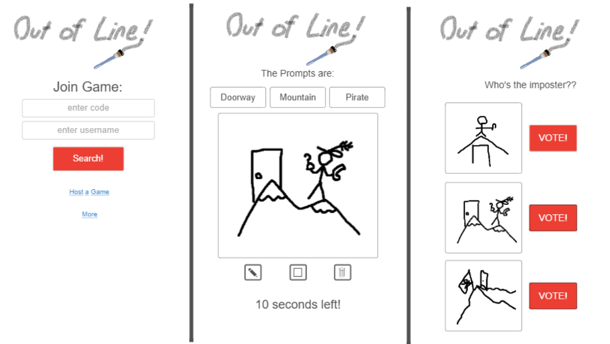
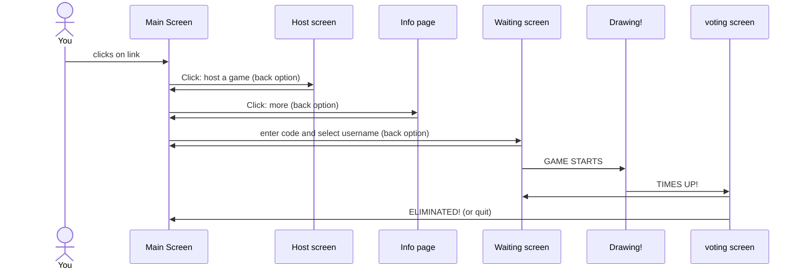

# Out of Line!

[My Notes](notes.md)

The appeal of a game like kahoot where a big crowd or just a small group can get together and play a hosted crowd game meets a hidden identity game like Chameleon where one player isn't in on the secret and has to pretend to fit in. Only this time, we're speed drawing. 

The host will give players a code to join their game and start it when everyone's in. 1 third of the players will be selected as the "doodlers" and the rest will be the "Artists." I got a random website to make us prompts for a drawing with 3 key words. Every Artist will see those 3 words on their screen and start drawing. The doodlers will only get 2 of the words and will have to guess the last one by peeking at those around them or making their drawing look vague. After time is up players vote on one of 3 drawings they're shown, one of them belonging to a doodler. The most voted get booted from the game and play is repeated till all doodlers have been caught or all the rounds have been played and the doodlers are still among the Artists.

## 🚀 Specification Deliverable

> [!NOTE]
>  Out of line is a simple multiplayer real time game where each player is given a prompt to draw and then voted out by the crowd before the next round starts.

For this deliverable I did the following. I checked the box `[x]` and added a description for things I completed.

- [X] Proper use of Markdown
- [X] A concise and compelling elevator pitch
- [X] Description of key features
- [X] Description of how you will use each technology
- [X] One or more rough sketches of your application. Images must be embedded in this file using Markdown image references.

### Elevator pitch

It's the ART of DECEPTION! Litterally! In this game a croud of people, or just a few friends get together to speed draw from a prompt. But be carful! Some of your friends are missing part of the prompt and have to make it up as they go. Can you spot the skethcy culprits and vote them out? Or stay hidden as one of the undercover doodlers? Whatever happens, don't get caught... Out of Line!

### Design

Here is some examples of what the game will look like including the main screen when you first enter the website, the game screen when you are playing, and a voting screen.

### Key features

- Home screen
- host options
- more information page
- game codes and usernames
- connecting to game host
- random promps from api
- drawing capabilities
- timer
- voting
- game win conditions

### Technologies

I am going to use the required technologies in the following ways.

- **HTML** - Basic structure of Words and logos and hypertext to other pages
- **CSS** - Adding lots of cute pictures, colors and backround images to make it more fun and attractive
- **React** - Drawing and voting capabilities
- **Service** - sending information like the drawings and vote results to host, as well as a call to a third party website that give the prompts
- **DB/Login** - saved sample drawings from games to show off
- **WebSocket** - realtime data going back and forth (mostly to host)

## 🚀 AWS deliverable

For this deliverable I did the following. I checked the box `[x]` and added a description for things I completed.

- [X] **Server deployed and accessible with custom domain name** - [My server link](https://yourdomainnamehere.click).

## 🚀 HTML deliverable

For this deliverable I did the following. I checked the box `[x]` and added a description for things I completed.

- [ ] **HTML pages** - I did not complete this part of the deliverable.
- [ ] **Proper HTML element usage** - I did not complete this part of the deliverable.
- [ ] **Links** - I did not complete this part of the deliverable.
- [ ] **Text** - I did not complete this part of the deliverable.
- [ ] **3rd party API placeholder** - I did not complete this part of the deliverable.
- [ ] **Images** - I did not complete this part of the deliverable.
- [ ] **Login placeholder** - I did not complete this part of the deliverable.
- [ ] **DB data placeholder** - I did not complete this part of the deliverable.
- [ ] **WebSocket placeholder** - I did not complete this part of the deliverable.

## 🚀 CSS deliverable

For this deliverable I did the following. I checked the box `[x]` and added a description for things I completed.

- [ ] **Header, footer, and main content body** - I did not complete this part of the deliverable.
- [ ] **Navigation elements** - I did not complete this part of the deliverable.
- [ ] **Responsive to window resizing** - I did not complete this part of the deliverable.
- [ ] **Application elements** - I did not complete this part of the deliverable.
- [ ] **Application text content** - I did not complete this part of the deliverable.
- [ ] **Application images** - I did not complete this part of the deliverable.

## 🚀 React part 1: Routing deliverable

For this deliverable I did the following. I checked the box `[x]` and added a description for things I completed.

- [ ] **Bundled using Vite** - I did not complete this part of the deliverable.
- [ ] **Components** - I did not complete this part of the deliverable.
- [ ] **Router** - I did not complete this part of the deliverable.

## 🚀 React part 2: Reactivity deliverable

For this deliverable I did the following. I checked the box `[x]` and added a description for things I completed.

- [ ] **All functionality implemented or mocked out** - I did not complete this part of the deliverable.
- [ ] **Hooks** - I did not complete this part of the deliverable.

## 🚀 Service deliverable

For this deliverable I did the following. I checked the box `[x]` and added a description for things I completed.

- [ ] **Node.js/Express HTTP service** - I did not complete this part of the deliverable.
- [ ] **Static middleware for frontend** - I did not complete this part of the deliverable.
- [ ] **Calls to third party endpoints** - I did not complete this part of the deliverable.
- [ ] **Backend service endpoints** - I did not complete this part of the deliverable.
- [ ] **Frontend calls service endpoints** - I did not complete this part of the deliverable.
- [ ] **Supports registration, login, logout, and restricted endpoint** - I did not complete this part of the deliverable.

## 🚀 DB deliverable

For this deliverable I did the following. I checked the box `[x]` and added a description for things I completed.

- [ ] **Stores data in MongoDB** - I did not complete this part of the deliverable.
- [ ] **Stores credentials in MongoDB** - I did not complete this part of the deliverable.

## 🚀 WebSocket deliverable

For this deliverable I did the following. I checked the box `[x]` and added a description for things I completed.

- [ ] **Backend listens for WebSocket connection** - I did not complete this part of the deliverable.
- [ ] **Frontend makes WebSocket connection** - I did not complete this part of the deliverable.
- [ ] **Data sent over WebSocket connection** - I did not complete this part of the deliverable.
- [ ] **WebSocket data displayed** - I did not complete this part of the deliverable.
- [ ] **Application is fully functional** - I did not complete this part of the deliverable.
