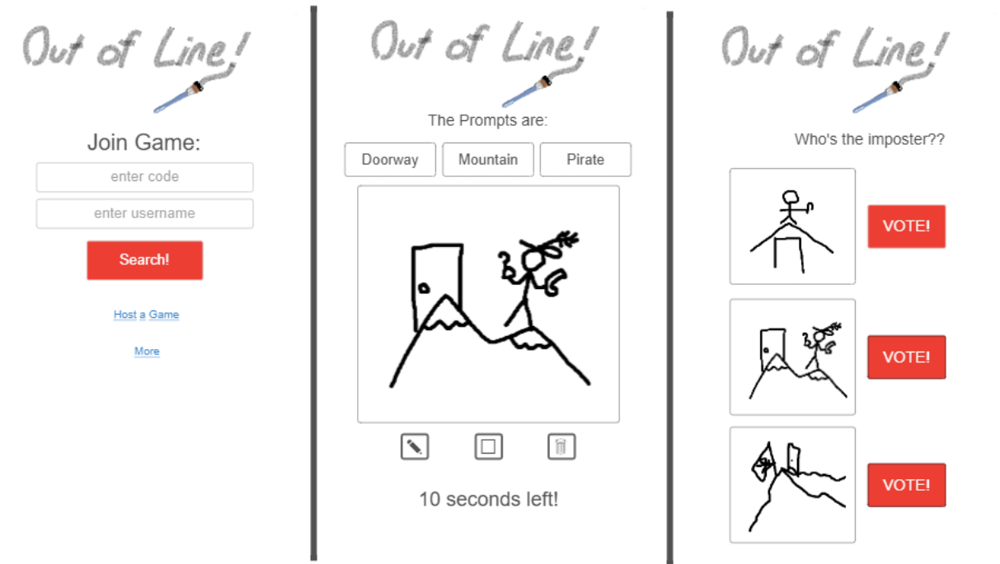
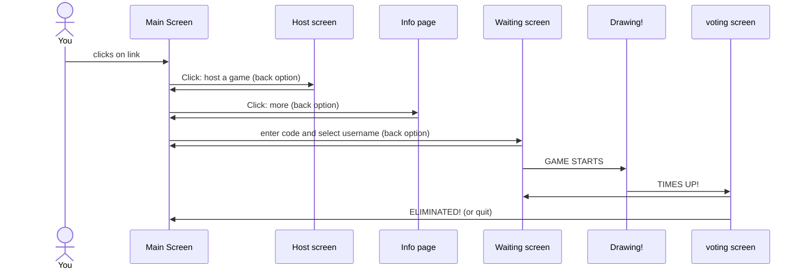

# Out of Line!

[My Notes](notes.md)

The appeal of a game like kahoot where a big crowd or just a small group can get together and play a hosted crowd game meets a hidden identity game like Chameleon where one player isn't in on the secret and has to pretend to fit in. Only this time, we're speed drawing. 

The host will give players a code to join their game and start it when everyone's in. 1 third of the players will be selected as the "doodlers" and the rest will be the "Artists." I got a random website to make us prompts for a drawing with 3 key words. Every Artist will see those 3 words on their screen and start drawing. The doodlers will only get 2 of the words and will have to guess the last one by peeking at those around them or making their drawing look vague. After time is up players vote on one of 3 drawings they're shown, one of them belonging to a doodler. The most voted get booted from the game and play is repeated till all doodlers have been caught or all the rounds have been played and the doodlers are still among the Artists.

## 🚀 Specification Deliverable

> [!NOTE]
>  Out of line is a simple multiplayer real time game where each player is given a prompt to draw and then voted out by the crowd before the next round starts.

For this deliverable I did the following. I checked the box `[x]` and added a description for things I completed.

- [X] Proper use of Markdown
- [X] A concise and compelling elevator pitch
- [X] Description of key features
- [X] Description of how you will use each technology
- [X] One or more rough sketches of your application. Images must be embedded in this file using Markdown image references.

### Elevator pitch

It's the ART of DECEPTION! Litterally! In this game a croud of people, or just a few friends get together to speed draw from a prompt. But be carful! Some of your friends are missing part of the prompt and have to make it up as they go. Can you spot the skethcy culprits and vote them out? Or stay hidden as one of the undercover doodlers? Whatever happens, don't get caught... Out of Line!

### Design

Here is some examples of what the game will look like including the main screen when you first enter the website, the game screen when you are playing, and a voting screen.

### Key features

- Home screen
- host options
- more information page
- game codes and usernames
- connecting to game host
- random promps from api
- drawing capabilities
- timer
- voting
- game win conditions

### Technologies

I am going to use the required technologies in the following ways.

- **HTML** - Basic structure of Words and logos and hypertext to other pages
- **CSS** - Adding lots of cute pictures, colors and backround images to make it more fun and attractive
- **React** - Drawing and voting capabilities
- **Service** - sending information like the drawings and vote results to host, as well as a call to a third party website that give the prompts
- **DB/Login** - saved sample drawings from games to show off
- **WebSocket** - realtime data going back and forth (mostly to host)

## 🚀 AWS deliverable

For this deliverable I did the following. I checked the box `[x]` and added a description for things I completed.

- [X] **Server deployed and accessible with custom domain name** - [My server link](https://outofline.click).

## 🚀 HTML deliverable

For this deliverable I did the following. I checked the box `[x]` and added a description for things I completed.

- [X] **HTML pages** - I made a couple, Index, Host, About, Wait, an Play
- [X] **Proper HTML element usage** - I think I did this right, used a wide range, mostly from the simon
- [X] **Links** - Lots of links to other pages, I think that's what this refers to
- [X] **Text** - Created lots of different kinds of texts for different purposes
- [X] **3rd party API placeholder** - The promps are place holders for this 3rd party API, Host Game > START! to see them
- [X] **Images** - The main title logo in every header was drawn and implemented by me
- [X] **Login placeholder** - Left from Simon
- [X] **DB data placeholder** - On the about page, the image I have there have some examples of what other players have drawn in the past, that image is a placeholder for that
- [X] **WebSocket placeholder** - The Start button and game connection with all the loading in player names on the wait and host pages are supposed to be this

## 🚀 CSS deliverable

For this deliverable I did the following. I checked the box `[x]` and added a description for things I completed.

- [X] **Header, footer, and main content body** - Made my header mostly based off simon but white theme and solid, body content was completly changed
- [X] **Navigation elements** - The header has these, spent a good amount of time making it behave the way I wanted. Favorite feature is scrolling on about page
- [X] **Responsive to window resizing** - Lot's of flex, all in the main.css file, I didn't need to do too much unique stuff so I kept it all there to keep it tidy
- [X] **Application elements** - A variety, mostly buttons and text tho, some lists
- [X] **Application text content** - The text didn't really need to be altered much from the bootstrap simon used (that I also borrowed)
- [X] **Application images** - There are images all over the place, most of them placeholder besides the logo and lower about image

## 🚀 React part 1: Routing deliverable

For this deliverable I did the following. I checked the box `[x]` and added a description for things I completed.

- [X] **Bundled using Vite** - I installed all the things for vite, set up my json files and ran tests with vite
- [X] **Components** - I made lots of components with my previously beutiful pages, however few are currently accessable
- [X] **Router** - I love all the directory organization and not having to see the .html in the browser address bar

## 🚀 React part 2: Reactivity deliverable

For this deliverable I did the following. I checked the box `[x]` and added a description for things I completed.

- [X] **All functionality implemented or mocked out** - I added a TON of functionality, including simulated players joining the host's room and then the rounds increase as a third of players are voted out and keeping track of the doodlers. In the join branch of components, there is now full canvas functionality as well as saving those images and displaying them in the vote sections. (It starts with placeholder images, just keep voting till you see your picture)(It also saves between rounds for now)
- [X] **Hooks** - I saved lots of variables in GameContext.jsx that can be accessed from all files, they manipulate that information and change things based on events including buttons clicked, timers running out of time and the game code being changed.

## 🚀 Service deliverable

For this deliverable I did the following. I checked the box `[x]` and added a description for things I completed.

- [X] **Node.js/Express HTTP service** - Added the service directory with json node modules and packages
- [X] **Static middleware for frontend** - I'm still fuzzy on what's middleware and what's not but I'm using some endpoints declared by simon as middleware
- [X] **Calls to third party endpoints** - Found a silly API that generates random words within catagories. Now we get actual random words for the prompts, first is an animal, second a sport and the last one gives us a brainrot word hehehe.
- [X] **Backend service endpoints** - added my own Backend endpoint that saves the gamecode I put in to later process
- [X] **Frontend calls service endpoints** - Within the login we call to the backend to store user information captured by the frontend such as the username and password
- [X] **Supports registration, login, logout, and restricted endpoint** - My login page now closely resembles the simon one with some modifications. Upon login it takes you to the join page (what used to be my login page) which only has one input for entering a game code. I liked the way simon did it better plus now I can restrict access to Host and Join until AFTER login.

## 🚀 DB deliverable

For this deliverable I did the following. I checked the box `[x]` and added a description for things I completed.

- [ ] **Stores data in MongoDB** - I did not complete this part of the deliverable.
- [ ] **Stores credentials in MongoDB** - I did not complete this part of the deliverable.

## 🚀 WebSocket deliverable

For this deliverable I did the following. I checked the box `[x]` and added a description for things I completed.

- [ ] **Backend listens for WebSocket connection** - I did not complete this part of the deliverable.
- [ ] **Frontend makes WebSocket connection** - I did not complete this part of the deliverable.
- [ ] **Data sent over WebSocket connection** - I did not complete this part of the deliverable.
- [ ] **WebSocket data displayed** - I did not complete this part of the deliverable.
- [ ] **Application is fully functional** - I did not complete this part of the deliverable.
